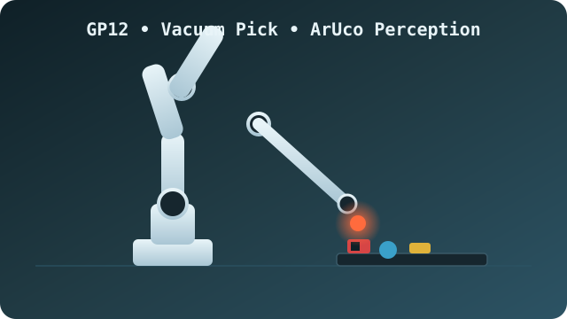
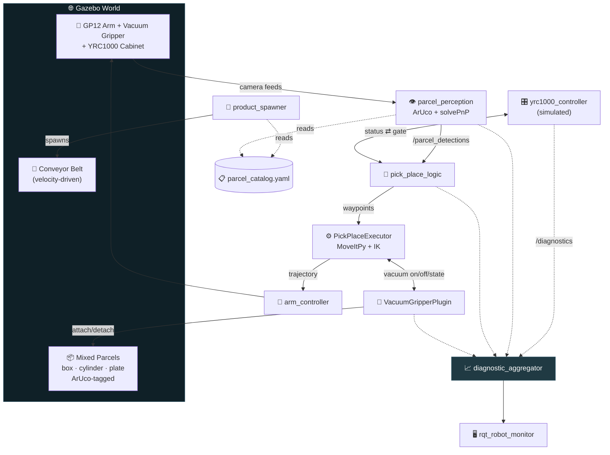

<div align="center">


<a href="https://github.com/ombhagwat18/high_fidelity_digital_twin_yakasawa_motoman_gp12">
  
</a>

<br/>

[](https://docs.ros.org/en/humble/)
[](https://classic.gazebosim.org/)
[](https://moveit.ros.org/)
[](https://ubuntu.com/)
[](https://www.python.org/)
[](https://isocpp.org/)

[]()
[]()
[]()

<br/>



</div>

<br/>

> **TL;DR** — A **virtual-only, industrially-modeled digital twin**: a Motoman GP12 arm sees randomly-shaped
> parcels (box / cylinder / flat plate) rolling down a moving conveyor via **ArUco-marker perception**,
> grasps them with a **vacuum gripper** at the correct orientation, and sorts them into bins — all gated by a
> **simulated YRC1000 controller** with real safety behaviour (E-stop, protective stop, `/diagnostics`).
> No real hardware exists yet; every simulated piece is a deliberate, drop-in-replaceable stand-in for the
> real thing later — see [**Real-Hardware Roadmap**](#-real-hardware-roadmap).

<br/>

## 📖 Table of Contents

- [✨ Features](#-features)
- [🧠 Tech Stack](#-tech-stack)
- [🏗️ System Architecture](#️-system-architecture)
- [📦 Package Map](#-package-map)
- [🚀 Quickstart](#-quickstart)
- [🎬 Demo](#-demo)
- [🛡️ Safety & Observability](#️-safety--observability)
- [🔁 Real-Hardware Roadmap](#-real-hardware-roadmap)
- [🧪 Testing](#-testing)
- [🗺️ What I Learned Building This](#️-what-i-learned-building-this)
- [📄 License](#-license)

<br/>

## ✨ Features

<table>
<tr>
<td width="50%" valign="top">

### 🎯 Perception
- ArUco-marker detection with **full 6-DOF pose** via `solvePnP` — real position *and* yaw, not just pixel coordinates
- Marker ID → shape/size/bin lookup from a single YAML catalog (`parcel_catalog.yaml`) — the spawner and the detector can never disagree
- Dual camera rig (overhead + front confirmation view), auto-generated marker textures at build time

### 🦾 Manipulation
- MoveIt2 (`MoveItPy`) + a hand-derived joint-space IK tuned for the GP12's kinematic chain
- **Orientation-aware grasping** — wrist rotates to match each parcel's marker yaw before descending
- Real vacuum physics: a custom Gazebo plugin **physically attaches/detaches** parcels (not a visual trick), with live grip confirmation

</td>
<td width="50%" valign="top">

### 🏭 Industrial-grade controller layer
- Simulated **YRC1000 controller**, modeled on Yaskawa's real `motoros2` ROS2 driver
- Servo on/off, E-stop, alarms, job/cycle telemetry
- **Automatic protective stop** after repeated grasp failures — the cell protects itself instead of retrying forever

### 📊 Observability & tuning
- `/diagnostics` from every node, aggregated into a live health board (`rqt_robot_monitor`)
- Real throughput/KPI reporting (cycle time, rolling throughput/hour) — not a debug string
- Every tunable value lives in YAML, not buried in code
- Operator RViz dashboard: planning scene + both camera feeds + TF, live

</td>
</tr>
</table>

<br/>

## 🧠 Tech Stack

<div align="center">

</div>

<div align="center">

| Layer | Tools |
|:---|:---|
| **Simulation** | Gazebo 11 (classic), custom C++ model plugins (conveyor drive, vacuum attach) |
| **Motion planning** | MoveIt2, OMPL, `ros2_control` + `gazebo_ros2_control` |
| **Perception** | OpenCV `cv2.aruco`, `solvePnP`, simulated Intel RealSense D435 |
| **Robot control** | Simulated YRC1000 controller (modeled on Yaskawa `motoros2`) |
| **Observability** | `diagnostic_updater`, `diagnostic_aggregator`, `rqt_robot_monitor` |
| **Description** | URDF/xacro, ROS2 `ros2_control` hardware interfaces |
| **Language** | Python 3.10 (`rclpy`), C++17 (`rclcpp`, Gazebo plugin API) |

</div>

<br/>

## 🏗️ System Architecture



<p align="center"><i>Full node graph, state machine, and launch-timing diagrams live in
<a href="docs/architecture/README.md">docs/architecture/README.md</a>.</i></p>

<br/>

## 📦 Package Map

| Package | Type | Role |
|:---|:---:|:---|
| [`warehouse_robot_description`](src/warehouse_robot_description) | 🔧 C++ | GP12 URDF/xacro, gripper, cameras, cosmetic YRC1000 cabinet |
| [`warehouse_gazebo`](src/warehouse_gazebo) | 🔧 C++ | World, conveyor plugin, mixed-shape parcel spawner, catalog |
| [`warehouse_gripper_control`](src/warehouse_gripper_control) | 🔧 C++ | Real vacuum-attach Gazebo plugin |
| [`warehouse_moveit_config`](src/warehouse_moveit_config) | ⚙️ Config | MoveIt2 SRDF/kinematics/controllers |
| [`warehouse_perception`](src/warehouse_perception) | 🐍 Python | ArUco 6-DOF perception node |
| [`warehouse_pick_place`](src/warehouse_pick_place) | 🐍 Python | State machine + MoveItPy motion executor |
| [`warehouse_controller`](src/warehouse_controller) | 🐍 Python | Simulated YRC1000 controller |
| [`warehouse_interfaces`](src/warehouse_interfaces) | 📨 Msgs | Custom ROS2 message definitions |
| [`warehouse_bringup`](src/warehouse_bringup) | 🚀 Launch | Top-level orchestration, diagnostics, RViz dashboard |
| [`warehouse_aruco_detection`](src/warehouse_aruco_detection) | 🐍 Python | Real-hardware ArUco path (GP12 + RealSense D455) |

<br/>

## 🚀 Quickstart

> Requires **Ubuntu 22.04 + ROS2 Humble + Gazebo11** (native or WSL2 — not plain Windows).

```bash
# Clone with the vendored Yaskawa submodule
git clone --recurse-submodules https://github.com/ombhagwat18/high_fidelity_digital_twin_yakasawa_motoman_gp12.git
cd high_fidelity_digital_twin_yakasawa_motoman_gp12

# Build
colcon build --symlink-install
source install/setup.bash

# Launch the full digital twin
ros2 launch warehouse_bringup bringup.launch.py

# In another terminal — watch the health board
ros2 run rqt_robot_monitor rqt_robot_monitor
```

<details>
<summary><b>Useful launch flags & commands</b></summary>

```bash
# Bare MoveIt planning-scene view instead of the camera+TF operator dashboard
ros2 launch warehouse_bringup bringup.launch.py use_operator_view:=false

# Headless (no RViz)
ros2 launch warehouse_bringup bringup.launch.py use_rviz:=false

# Watch what perception is seeing
ros2 topic echo /parcel_detections

# Watch throughput/KPIs
ros2 topic echo /pick_place/stats

# Trigger / release an E-stop
ros2 service call /yrc1000/estop std_srvs/srv/SetBool "{data: true}"
```
</details>

<br/>

## 🎬 Demo

The banner illustration above is an original hand-drawn SVG (`docs/media/robot_arm.svg`), not a
screenshot — this project is simulation-only right now, and no Gazebo/RViz recordings exist yet.

> 🎥 **Real screenshots/GIFs coming soon.** Drop your own Gazebo/RViz recordings into `docs/media/`
> and reference them here (e.g. `docs/media/pick_cycle.gif`, `docs/media/operator_dashboard.png`)
> once you've captured a run — see `docs/media/README.md` for the suggested capture list.

<br/>

## 🛡️ Safety & Observability

This isn't just "does it run once" — it's built to *notice when it's failing*:

- 🚨 **Protective stop** — 3 consecutive grasp failures auto-triggers `/yrc1000/protective_stop` (a distinct
  alarm code from a manual E-stop) instead of endlessly retrying a broken grasp.
- 📈 **Live health board** — every node publishes `/diagnostics`; `diagnostic_aggregator` groups them into
  Controller / Perception / PickPlace / Gripper for `rqt_robot_monitor`.
- 🔒 **Explicit recovery sequence** — alarm reset → E-stop release → servo-on, exactly mirroring how a real
  industrial cell requires a deliberate operator acknowledgement, not a silent auto-resume.

<br/>

## 🔁 Real-Hardware Roadmap

| Simulated today | Swaps to | What changes |
|:---|:---|:---|
| `gazebo_ros2_control` | Real GP12 + YRC1000 (`motoros2`) | `ros2_control_plugin` xacro arg + hardware interface |
| `yrc1000_controller` (this repo) | Real YRC1000 bridge | Swap the node; topic/service names stay identical |
| `VacuumGripperPlugin` | Real vacuum solenoid + switch I/O | Swap for a real I/O driver, same 3-topic interface |
| `parcel_perception` (sim ArUco) | `warehouse_aruco_detection` (real ArUco + D455) | Already a separate package — just launch the other one |

<br/>

## 🧪 Testing

Every package is fully scaffolded for `colcon test` (lint + copyright + style):

```bash
colcon test --packages-select warehouse_pick_place
colcon test-result --verbose
```

<br/>

## 🗺️ What I Learned Building This

<div align="center">

</div>

- Designing a multi-node ROS2 system with clean topic/service seams meant for a real hardware swap later
- Writing custom Gazebo model plugins in C++ (physics joint attach/detach, velocity control) with a ROS2 node embedded inside
- 6-DOF pose estimation from a single planar marker (`solvePnP`) and camera-extrinsic math via homogeneous transforms
- Modeling an industrial controller's safety behaviour (E-stop vs. protective stop) instead of just "it moves"
- Structuring configuration, diagnostics, and KPIs the way a real deployed robot cell would expect them

<br/>

## 📄 License

License is being finalized — see individual `package.xml` files for current per-package declarations.

<br/>

<div align="center">


Built with 🦾 by <a href="https://github.com/ombhagwat18">@ombhagwat18</a>

</div>
