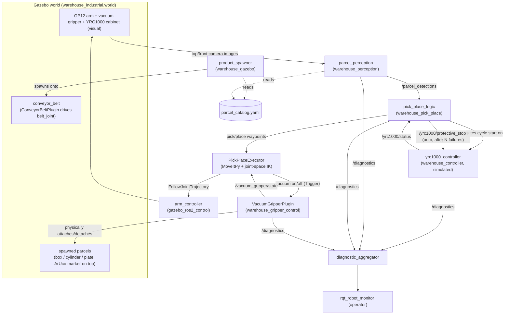
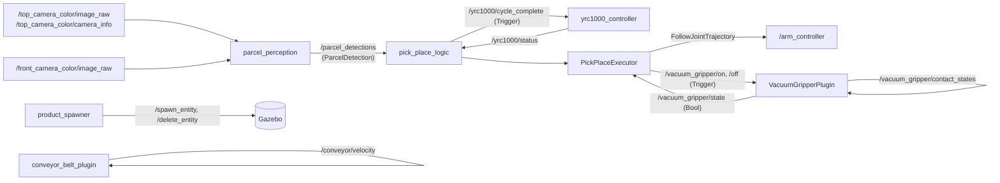
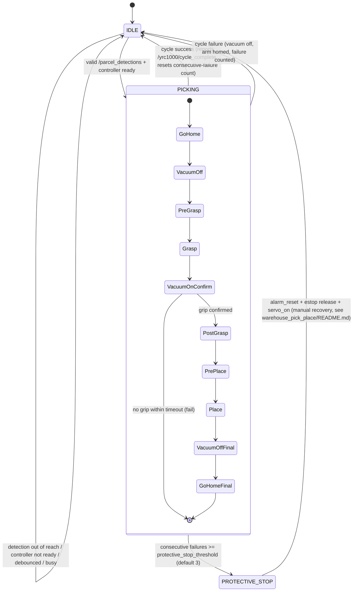

# GP12 Digital Twin — Architecture

Virtual-only digital twin of a Yaskawa Motoman GP12 arm palletizing
mixed-shape parcels off a moving conveyor, using ArUco-marker perception and
a vacuum gripper. There is no real robot or controller connected — every
piece that would eventually talk to real hardware is built as a clearly
named, drop-in-replaceable seam (see "Swap points for real hardware" below).

## System overview

## Node/topic graph

## Pick cycle state machine

## Launch timing ladder (`warehouse_bringup/launch/bringup.launch.py`)

```mermaid
gantt
    dateFormat X
    axisFormat %Ss
    section Sim
    Gazebo + gzserver          :0, 1s
    Robot spawn                :5, 1s
    joint_state_broadcaster    :12, 1s
    arm_controller             :14, 1s
    section Digital twin
    YRC1000 controller (sim)   :1, 1s
    Parcel perception          :15, 1s
    MoveIt2 move_group         :17, 1s
    RViz2                      :20, 1s
    Pick-and-place logic       :22, 1s
    Product spawner            :25, 1s
```

## Configuration (externalized YAML, not buried constants)

| File | Node(s) | Covers |
|---|---|---|
| `warehouse_gazebo/config/parcel_catalog.yaml` | `product_spawner`, `parcel_perception` | marker ID → shape/dims/bin |
| `warehouse_perception/config/parcel_perception.yaml` | `parcel_perception` | marker size, ArUco dict, debug window |
| `warehouse_pick_place/config/pick_place_params.yaml` | `pick_place_logic` (and `PickPlaceExecutor`, same node) | reach envelope, debounce, min confidence, protective-stop threshold, approach/lift geometry, vacuum confirm timeout |
| `warehouse_controller/config/yrc1000_params.yaml` | `yrc1000_controller` | job name |
| `warehouse_bringup/config/diagnostics.yaml` | `diagnostic_aggregator` | subsystem grouping for `/diagnostics` |
| `warehouse_bringup/config/operator.rviz` | `rviz2` (default view) | camera feeds + TF + planning scene |

## Health monitoring & safety

Every node publishes `/diagnostics` (`diagnostic_updater` in Python nodes,
a direct `diagnostic_msgs/DiagnosticArray` publish in the C++ gripper
plugin), aggregated by `diagnostic_aggregator` into Controller/Perception/
PickPlace/Gripper groups — view with `ros2 run rqt_robot_monitor
rqt_robot_monitor`.

`pick_place_logic` also enforces a real protective-stop behaviour: after
`protective_stop_threshold` (default 3) consecutive cycle failures, it calls
`/yrc1000/protective_stop` itself rather than retrying a broken grasp
forever — a distinct alarm code from a manual `/yrc1000/estop`, so
`rqt_robot_monitor`/`/yrc1000/status` show *why* the cell stopped. Recovery
is the explicit 3-step sequence in `warehouse_pick_place/README.md`.

## Swap points for real hardware (later)

| Simulated piece today | Real replacement later | What has to change |
|---|---|---|
| `gazebo_ros2_control` (GazeboSystem plugin) driving the arm | Real GP12 + YRC1000 via `motoros2` | `ros2_control_plugin` xacro arg + hardware interface; `arm_controller`'s action name stays the same |
| `yrc1000_controller` (this repo) | Real YRC1000 via `motoros2` bridge | Swap the node; keep `/yrc1000/status`, `/yrc1000/servo_on`, `/yrc1000/estop` names identical so `pick_place_logic.py` needs no changes |
| `VacuumGripperPlugin` (Gazebo attach/detach) | Real vacuum solenoid + vacuum switch I/O | Swap for a real I/O driver exposing the same `/vacuum_gripper/on`, `/off`, `/state` interface |
| `parcel_perception` (ArUco on synthetic markers) | `warehouse_aruco_detection`'s real-hardware nodes (`aruco_detector.py`, Intel RealSense D455) | Already a separate package/pipeline — just switch which perception package is launched |
| Camera: simulated RealSense D435 (Gazebo model) | Real Intel RealSense D455 | `warehouse_aruco_detection` already targets D455 separately; camera extrinsics need re-measuring for the real cell |

## Known leftover issues (not fixed in this pass)

- `warehouse_aruco_detection/launch/aruco_sim.launch.py` does not actually
  contain a launch description — it's a stray copy of an older
  `aruco_detector_sim.py` draft with different (now-superseded) camera
  geometry constants. It's dead weight, not wired into anything, and belongs
  to the real-hardware package this rebuild deliberately left untouched.
- The wrist-yaw alignment in `pick_place.py`'s `_wrist_j6_for_yaw` is a
  documented approximation (`world yaw ≈ j1 + j6`), not a derived closed-form
  result — verify visually in Gazebo and tune `WRIST_YAW_SIGN`/add an offset
  if the gripper doesn't align with the marker as expected.
- The visual YRC1000 cabinet does not change colour with live controller
  status (would need a custom Gazebo material-set plugin) — see
  `yrc1000_cabinet.xacro`'s comment.
- `warehouse_bringup/config/operator.rviz` was hand-written (not saved from a
  running RViz2), since no RViz was available to save it from — the
  `Image`/`TF` display block field names/types should match the real
  `rviz_default_plugins` schema, but confirm on first launch and adjust if
  RViz reports a config-parsing warning.
- The `diagnostic_updater` Python API usage (`Updater`, `DiagnosticStatusWrapper`
  from the `diagnostic_updater` package, used in `yrc1000_controller.py`,
  `parcel_perception.py`, and `pick_place_logic.py`) is based on the known
  ROS2 `diagnostic_updater` API shape but was never import-tested in this
  environment — if any of those three nodes fails to start with an
  `ImportError`/`AttributeError` around `diagnostic_updater`, check the
  actual installed API (`ros2 pkg xml diagnostic_updater`,
  `python3 -c "import diagnostic_updater; help(diagnostic_updater)"`) and
  adjust; the fix is the same in all three files.
- No environment here could actually run `colcon build` / Gazebo / RViz to
  verify any of this end-to-end (Windows Git Bash, no WSL distro installed) —
  see the verification checklist below.

## Verification checklist (run on your actual ROS2 Humble / Gazebo11 machine)

1. `colcon build --symlink-install` — should build cleanly, including the two
   new C++ packages (`warehouse_gripper_control`, and `warehouse_gazebo`'s new
   `conveyor_belt_plugin`) and the new `warehouse_controller` Python package.
2. `ros2 launch warehouse_bringup bringup.launch.py`
3. `ros2 topic hz /top_camera_color/image_raw` and `/front_camera_color/image_raw`
   — confirms Phase 0's camera rename actually resolves to these topic names
   on your installed `gazebo_ros` version (flagged in `parcel_perception.py`'s
   docstring as unverified without a simulator).
4. Watch Gazebo: conveyor belt should visibly scroll; mixed box/cylinder/plate
   parcels with a visible ArUco square on top should spawn and travel toward
   the robot.
5. `ros2 topic echo /parcel_detections` — confirms shape/bin/yaw come through.
6. `ros2 topic echo /yrc1000/status` — confirms the simulated controller is up.
7. Watch a full pick cycle in Gazebo — vacuum cup should visibly pick up a
   parcel (physically attached, not just visually near it) and place it in
   the correct bin; check the wrist visibly rotates to the marker's angle
   during grasp.
8. `ros2 service call /yrc1000/estop std_srvs/srv/SetBool "{data: true}"` —
   confirms new cycles stop dispatching while E-stop is engaged.
9. `ros2 run rqt_robot_monitor rqt_robot_monitor` — confirms Controller/
   Perception/PickPlace/Gripper rows appear and go red on E-stop/protective
   stop.
10. `ros2 topic echo /pick_place/stats` — confirms `PickPlaceStats` fields
    (not the old JSON string) update after each cycle.
11. Force 3 consecutive grasp failures (e.g. temporarily set
    `reach_x_min`/`reach_x_max` in `pick_place_params.yaml` so parcels are
    always rejected as out-of-reach) and confirm `/yrc1000/status` shows
    E-stop engaged with `alarm_code=8020` (protective stop, distinct from
    the manual E-stop's `8010`) and that `pick_place_logic` stops
    dispatching until the recovery sequence in
    `warehouse_pick_place/README.md` is run.
12. `ros2 launch warehouse_bringup bringup.launch.py use_operator_view:=false`
    — confirms the toggle actually switches to the bare MoveIt-only RViz
    config.
